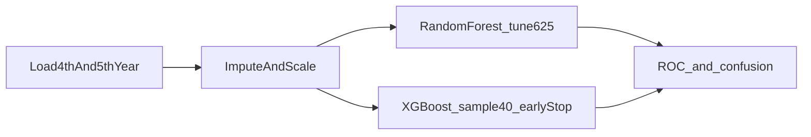
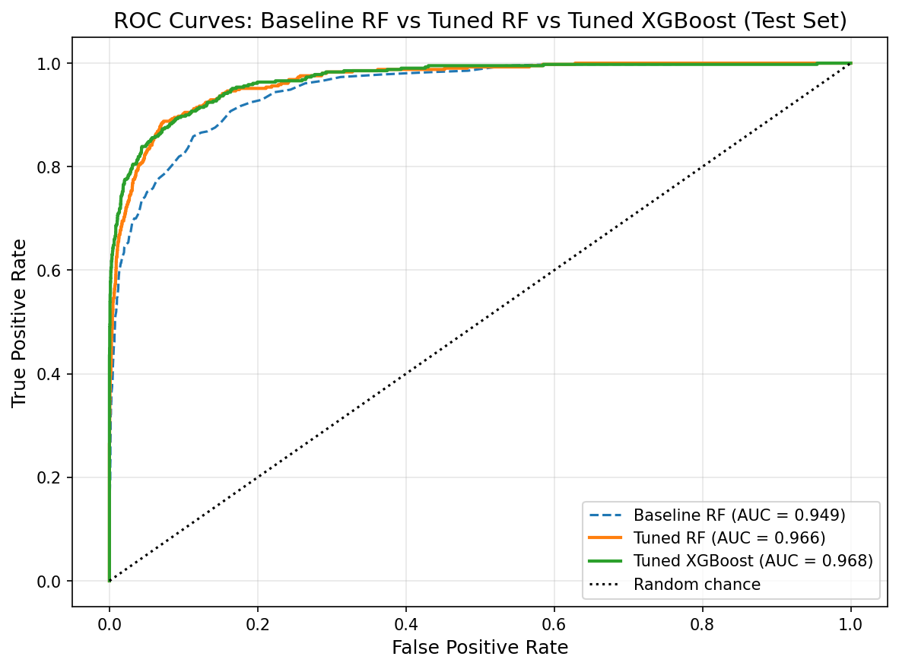
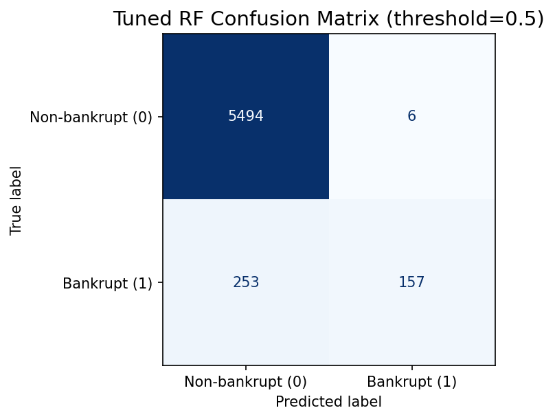
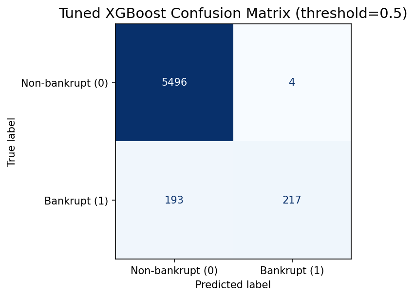

# Bankruptcy Prediction (Random Forest and XGBoost)

Binary bankruptcy classifier on the **Polish companies bankruptcy** dataset ([UCI](https://archive.ics.uci.edu/dataset/365/polish+companies+bankruptcy+data)). The pipeline trains on the **4th-year** ARFF file and evaluates on the **5th-year** file (temporal split), comparing **Random Forest** and **XGBoost** with ROC-AUC and confusion matrices.

**License:** [MIT](LICENSE)

## Results

| Model | Metric | Value |
|-------|--------|-------|
| RF baseline | Train OOF CV AUC | 0.8846 |
| RF baseline | 5th-year test AUC | 0.9492 |
| RF tuned | Tuning CV mean | 0.9179 |
| RF tuned | Train OOF CV AUC | 0.9173 |
| RF tuned | 5th-year test AUC | 0.9657 |
| XGB baseline | Validation AUC | 0.9264 |
| XGB baseline | 5th-year test AUC | 0.9678 |
| XGB tuned | Tuning CV mean (3-fold) | 0.9392 |
| XGB tuned | Validation AUC | 0.9431 |
| XGB tuned | Train OOF CV AUC (5-fold) | 0.9366 |
| XGB tuned | 5th-year test AUC | 0.9712 |

## Pipeline



**Design choices**

- **Temporal split** — 4th year train, 5th year test (no random split within a single file)
- **RF** — 300 trees fixed; four hyperparameters searched over five values each (625 configs)
- **XGBoost** — early stopping (max 1000 rounds); six hyperparameters, 40 random samples from a 15,625-point grid
- **Imbalance** — `class_weight="balanced"` for RF; ROC-AUC as primary metric

## Key figures







## Quick start

**Requirements:** Python 3.10+ (tested on 3.13). Full pipeline runtime is **1–2+ hours** on a typical laptop (625 RF configurations). Use `--quick` for a smoke test (~2 minutes).

```bash
git clone https://github.com/Rhines7/bankruptcy-prediction-rf-xgb.git
cd bankruptcy-prediction-rf-xgb
pip install -r requirements.txt
```

### 1. Set up data

The ARFF files are **not** included in this repository. Follow [data/README.md](data/README.md) to download and place `4year.arff` and `5year.arff` under `data/`.

### 2. Run the pipeline

```bash
python bankruptcy_classifier.py
```

Smoke test:

```bash
python bankruptcy_classifier.py --quick
```

Figures are written to `figures/` as PNG. For a step-by-step walkthrough, open [`bankruptcy_classifier.ipynb`](bankruptcy_classifier.ipynb).

### 3. Read the report

Written analysis: [docs/report.tex](docs/report.tex) (compile with figures in `figures/`). A compiled PDF is also available at [docs/report.pdf](docs/report.pdf).

## Project structure

```text
bankruptcy-prediction-rf-xgb/
├── bankruptcy_classifier.py    # Entry point
├── bankruptcy/                 # Implementation package
│   ├── config.py
│   ├── io.py
│   ├── preprocess.py
│   ├── rf_model.py
│   ├── xgb_model.py
│   ├── viz.py
│   └── pipeline.py
├── bankruptcy_classifier.ipynb # Notebook walkthrough
├── figures/                    # Generated plots
├── docs/report.tex             # LaTeX report
├── data/README.md              # Dataset setup
├── requirements.txt
└── LICENSE
```

## Tech stack

Python · NumPy · SciPy · scikit-learn · XGBoost · matplotlib

## Limitations

- Single temporal split (4→5); performance may differ on other year pairs
- No company-level deduplication across years
- Default 0.5 threshold; cost-sensitive thresholds not optimized

## Author

Robert Hines (2026)
